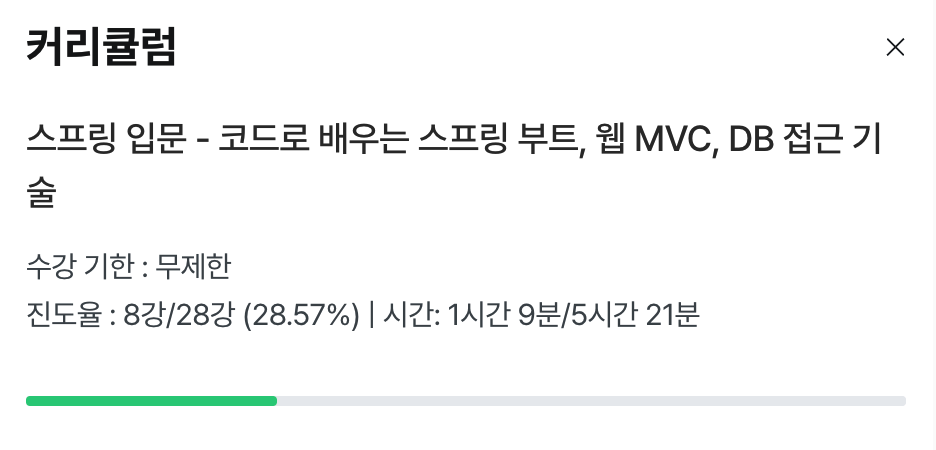
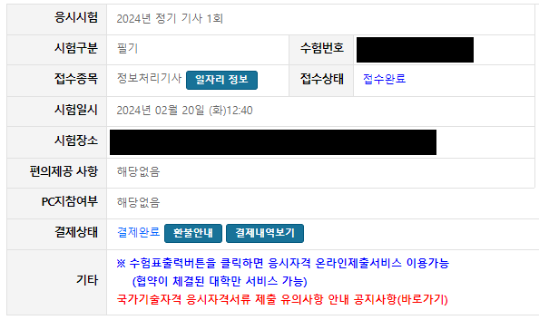

이전 잡담 글을 올린 지 거의 3주가 되어갑니다. 별 일 없었지만, 그래도 조금이라도 써 봅니다.

## 인프런 수강 현황

3주 전 듣기 시작한 인프런 강의의 현황입니다. 좀 쉬면서 듣느라 얼마 듣지는 못 했는데, 강의의 퀄리티 자체는 좋은 것 같습니다.

## 기사 시험 신청 및 필기 가채점 합격

정보처리기사를 볼까 말까 고민을 많이 했는데, 어찌 되었든 봐서 손해 볼 건 없겠다 싶어 일단 신청해서 필기를 봤습니다. 대비해서 책도 샀는데 시험 이틀 전부터 공부를 시작해, 기출문제를 4회정도만 풀어보고 갔습니다. 필기는 객관식이어서 조금 여유있게 공부해야겠다 싶었는데, 기출문제를 처음 보고 생각보다 어렵다 느끼긴 했습니다. 그래도 문제은행 식의 출제 스타일과 상식과 전공 지식으로 풀 수 있던 문제들 덕분에 어찌어찌 가채점 상으로 합격이라 뜬 것을 확인 후에 나왔습니다.

## 마무리

별 거 없었지만 그래도 두 번째 글을 썼네요 드디어.

아, 그리고 원래 블로그에 이용하는 사진들을 디스코드 채널에 올려 해당 링크를 사용하는 방식으로 썼는데, 몇 달 전 [디스코드에 업로드 된 사진의 링크가 24시간 동안만 유지되는 것](https://www.engadget.com/discord-is-switching-to-expiring-links-for-files-shared-off-platform-202533531.html)으로 변경되었더라구요. 그래서 그냥 이미지를 같이 올리는 방식으로 바꿨습니다.
