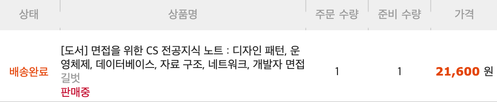
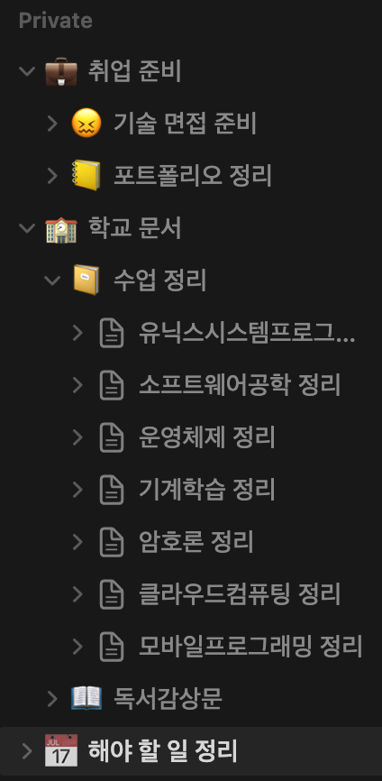

학교 개학하니까 바쁘네요. 하는 것도 없으면서 바쁨;

그래도 나름 하고 있는 거 써보겠습니다..

## 면접을 위한 CS 전공지식 노트

친구와 같이 공부하기 위해 샀습니다. 전공 내용을 리마인드할 수 있는 폭이 넓어서 좋은 것 같습니다.

## 인프런 수강 및 다른 강의?

사실 인프런 수강은 저번 글에서 멈춰있습니다. 개학도 하고, 수업 듣고 하다보니 좀 늦어지고 있네요.

지금 다른 React 강의도 찾아놔서 그것도 들어보고 싶은데, 그냥 시간이 부족하네요.

분명히 저번 학기보다 듣는 학점도 낮은데 왜 이러지;;

## Notion 정리

지금까지 써두었던 노션 문서들과 이후 써 나갈 것들을 정리했습니다.

그리고 해야 할 일 문서를 만들어 목록 및 캘린더로 마감일을 확인할 수 있게 만들었는데, 상당히 괜찮은 듯합니다.

해당 문서는 [다음](https://www.notion.so/templates/to-do-list)을 참고하였습니다.

## 마무리

이거 제 소원임.
