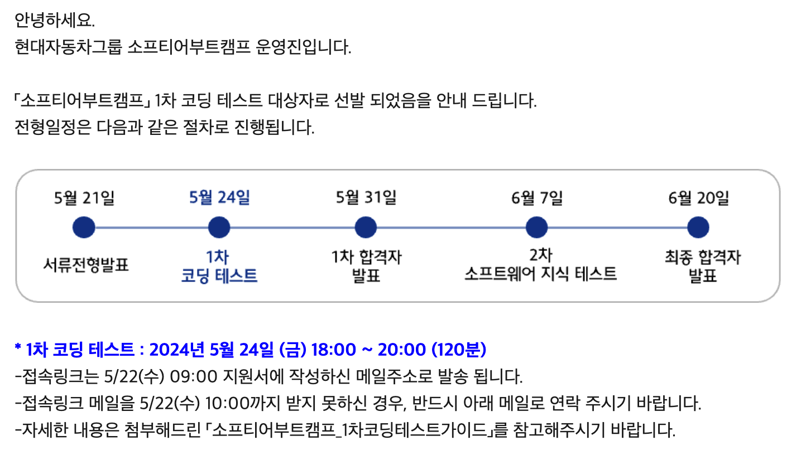
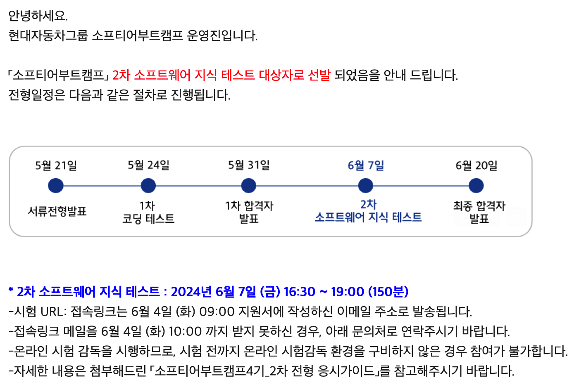
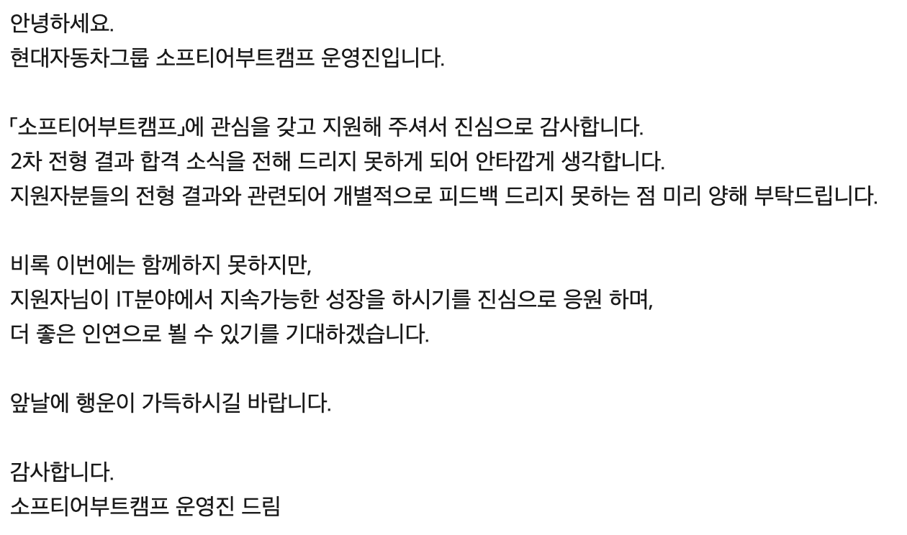
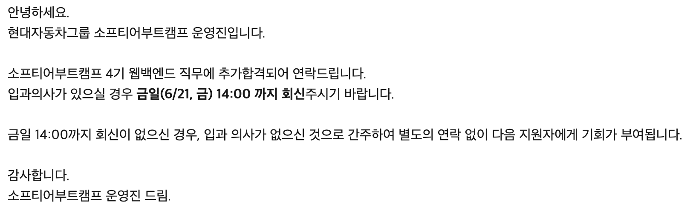

## 현대자동차그룹 소프티어 부트캠프 4기 웹백엔드 전형

저는 이번 현대자동차그룹 소프티어 부트캠프 4기에 웹백엔드 전형으로 지원을 했습니다. 그 후기를 작성하고자 합니다.

## 1차 코딩 테스트

우선 지원하고 나서, 서류에서 떨어지진 않겠지? 라고 생각했는데, 다행히 1차 테스트 기회를 얻었습니다.

코딩 테스트 준비는 학기 중이라 스터디에서 진행하던 문제 풀이, 그리고 친구와 함께 따로 간간히 문제를 풀어왔습니다. 저는 알고리즘 대신 주로 구현 문제를 풀었으며, 실버~골드 하위권 문제들을 빠르게 풀기 위해 노력했던 것 같습니다.

코딩 테스트 결과는 나오지는 않지만, 개인적으로 되돌아 봤을 때에는 1~2문제의 예외조건을 맞추지 못한 것을 제외하면 거의 맞게 한 것 같습니다. 일단 전부 코드를 작성하긴 했습니다.

## 2차 소프트웨어 지식 테스트

1차 코딩 테스트를 보고 나서 한 일주일정도 후 2차 테스트 대상자 선발 메일이 왔습니다.

사실 소프트웨어 지식 테스트라는 게 어떤 형태의 문제가 나올 지 알 수 없어서 여러 가지로 기존 기수의 후기들을 검색해봤습니다.

그래서 저도 다른 분들이 추천하신 여러 사이트에서 전공 지식들을 리마인드했습니다.

실제 시험을 보니, 다들 중요하다고 생각하시는 그것들을 공부하시면 될 듯 합니다. 사실 저는 열심히 하나하나 외우지는 않아서 꽤 틀렸습니다...

## 탈락 후 추가합격

시험을 보고 2주 가량 시간이 지난 후, 탈락했다는 메일이 오게 되었습니다. 그런데...

탈락 메일 다음 날 아침, 추가 합격 메일이 오게 되었습니다. 아무래도 예비 순위가 꽤나 높았던 것 같습니다.

## 결과

결국 합격은 했지만, 입과를 하지는 않았습니다.

이유는 여러 가지가 있었지만, 우선 오프라인 교육이라는 것도 꽤 부담이 있었습니다. 저는 지방에서 사는 학생이고, 2달간 교육을 받으려면 숙소를 구해야 하는 상황이었습니다.

또, 2달이라는 교육도 제 입장에서는 좀 짧다는 생각을 했습니다. 2달간 배워서 제가 백엔드 직무로 취업을 할 수 있을까 생각을 했을 때, 확실하지 않다는 생각을 했습니다. 그리고 위의 숙소를 구해야 되는 상황과 연계되어 2달짜리 교육을 듣기 위해 서울에 올라가는 것도 저한테는 부담이 되는 상황이었습니다.

마지막으로는 취업 연계의 불확실성이었습니다. 이전 기수 후기들을 읽어보니 취업 연계율이 굉장히 낮다는 이야기가 있었습니다.

사실 여러 가지 이유로 입과를 포기하긴 했지만, 제가 만약 서울에 살았으면 가벼운 마음으로 합격한 김에 교육을 들었을 것 같습니다. 다른 분들은 합격하시면 교육을 들으시는 것을 추천드립니다.

저는 현재는 다른 교육 커리큘럼 진행 중에 있습니다. 해당 과정에 대해서도 추후 후기 글을 올리겠습니다.
