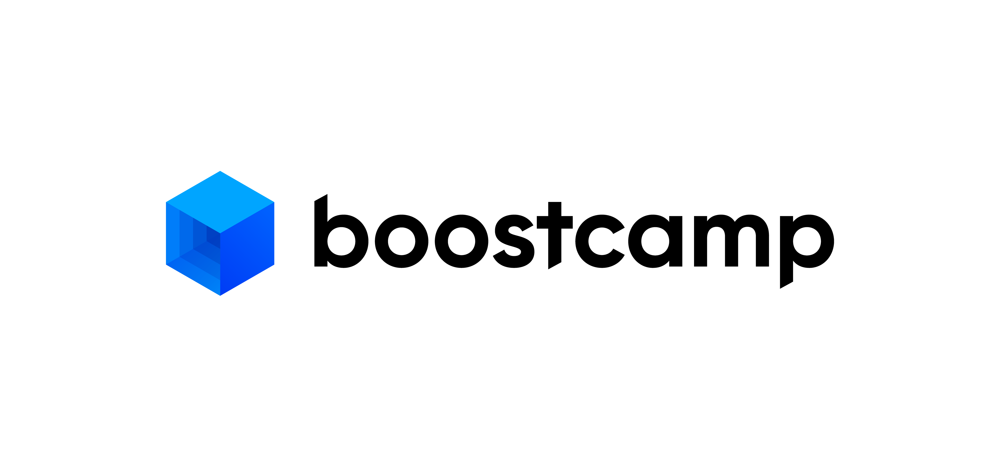
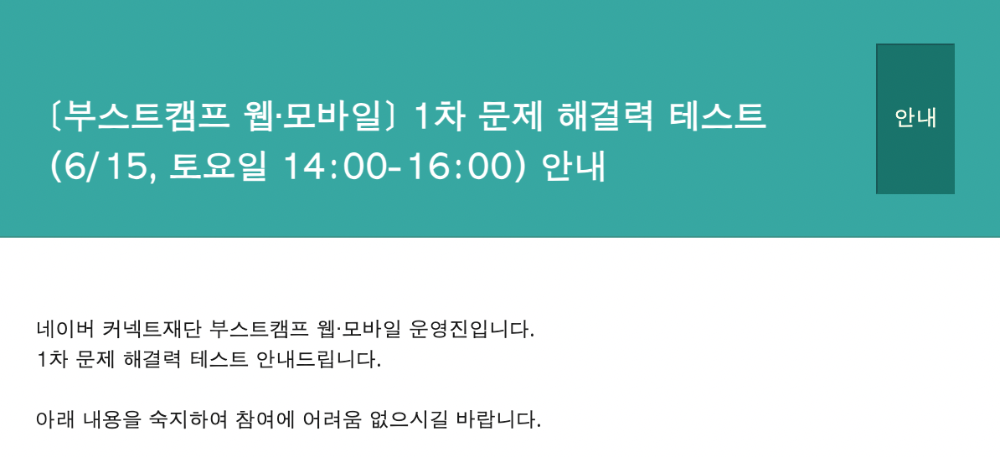
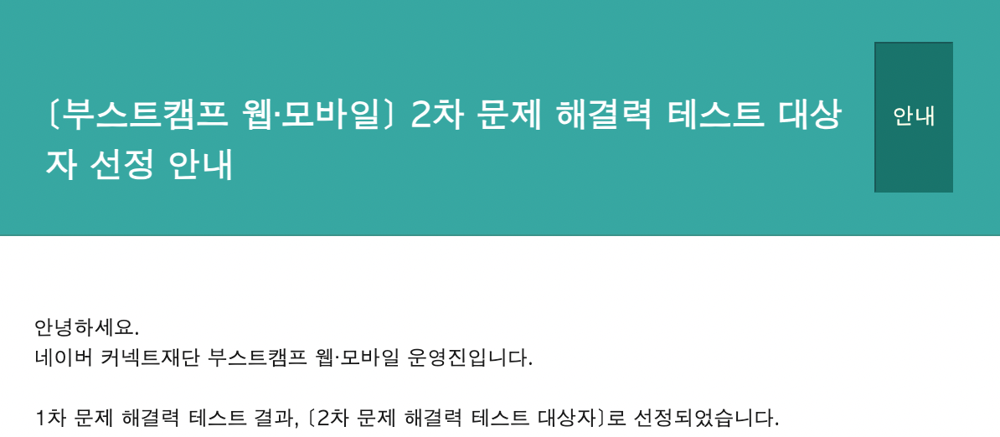
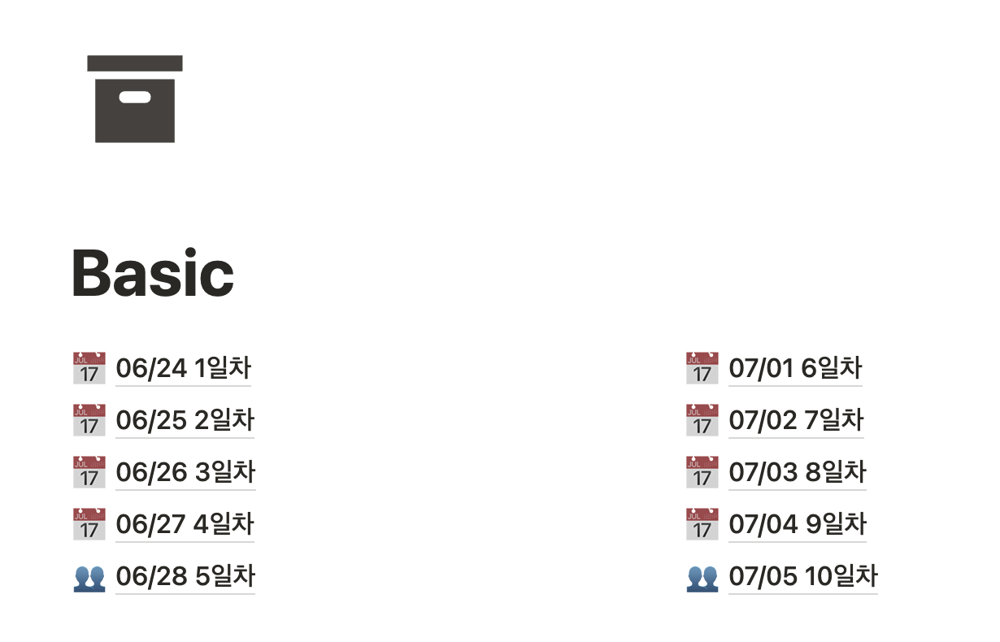
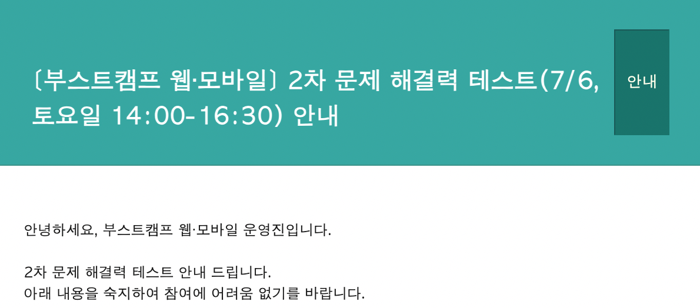
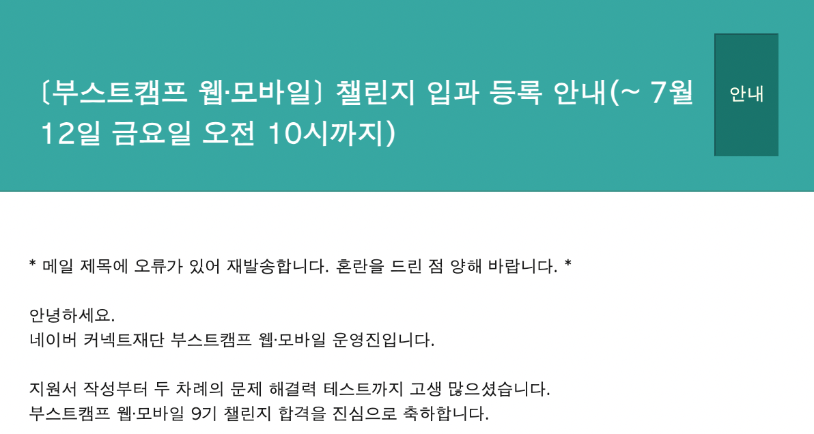
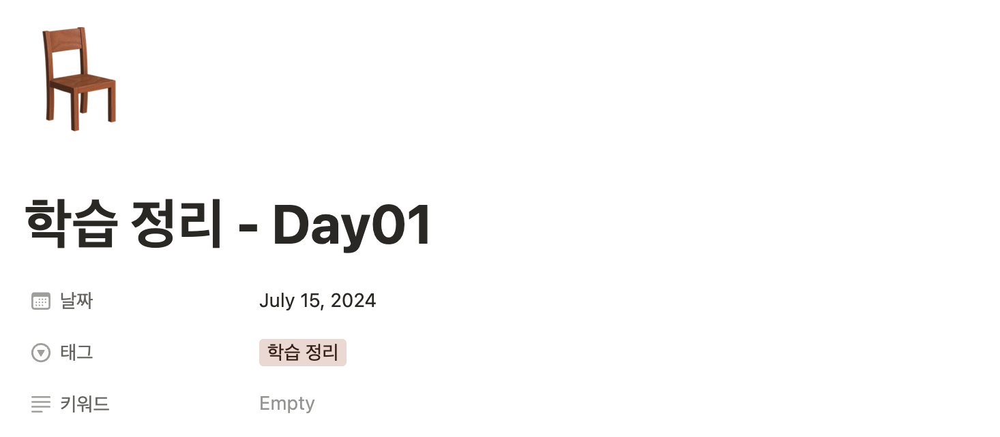
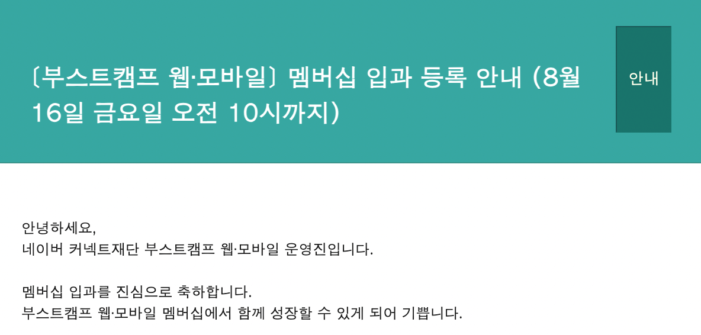

## 부스트캠프 웹∙모바일 9기 웹 풀스택(JavaScript) 전형

저는 **[부스트캠프 웹∙모바일](https://boostcamp.connect.or.kr/) 9기 웹 풀스택(JavaScript)** 과정에 지원하였습니다. 그 과정에 대해 적어보고자 합니다.

## 지원 계기

저는 현재 실제 웹 개발 경험이 부족한 상황입니다. 학교 프로젝트로 약간의 Spring과 express.js를 경험해 본 바는 있지만, 해당 부분은 제가 주도해서 코딩하지 않았거나, 정말 샘플 정도의 REST API가 필요했던 경우였기에 웹 쪽에서의 여러 문제 해결 경험을 갖기 힘들었습니다.

그랬던 때에 앞서 작성했던 소프티어 부트캠프와 부스트캠프가 보였고, 둘 다 지원하게 되었습니다. 부스트캠프는 온라인으로 진행되기에 지방에 사는 입장에서 교육을 듣기 편하겠다는 생각이 들었습니다. 다만, JavaScript 풀스택 교육은 약간의 걱정이 있긴 했는데, JavaScript를 많이 다뤄보지 않았을 뿐더러 언어 자체가 까다롭다는 이야기들을 많이 들은 상황이었습니다. 그래도 어떤 언어로든 웹 개발을 경험해보고 문제를 해결해나가다보면, 언어나 프레임워크는 큰 문제가 아니라고 생각하기에 큰 거부감 없이 지원하였습니다.

## 1차 문제 해결력 테스트

1차 문제 해결력 테스트를 보았고, 문제는 무난했습니다. 다 풀 수 있는 문제들이었고, 풀고 전부 제출하였습니다. 사실 너무 오래되어서 기억이 가물가물합니다...

이번 부스트캠프 9기는 베이직 과정이 신설되어, 1차 문제 해결력 테스트 결과에 따라 베이직 과정으로 가서 학습 후에 2차 문제 해결력 테스트를 보는 경우가 있는데, 저는 베이직 과정을 거치지 않아도 되는 대상자로 선정되었습니다. 하지만 2차부터는 각 과정에 맞는 언어(웹 풀스택 같은 경우 JavaScript)로 테스트를 봐야 하는데, JavaScript에 자신이 없어 저는 베이직 과정을 듣는 것으로 결정하였습니다.

## 베이직 과정

저는 베이직 과정을 들으면서, 나오는 미션에 맞춰서 JavaScript 기본 문법에 대해 학습하고 노션에 따로 정리해두었습니다.

그렇게 9일차까지 잘 참석하였는데... 마지막 10일차에 개인 사정으로 인해 참여하지 못하여 베이직 과정 수료증을 받지는 못하였습니다. (다만, 저는 이미 2차 테스트 대상자로 선정되었기에 테스트를 보는 것에는 문제가 없었습니다.)

## 2차 문제 해결력 테스트

그렇게 2차 문제 해결력 테스트를 보았습니다. 문제들에서 베이직 과정에서 들었던 키워드들이 몇 나오긴 했지만, 검색이 가능한 시험이었기에 큰 문제는 되지 않을 것 같습니다.

저는 일단 모든 문제를 다 풀어서 제출했고, 제 예상으로는 프로그래밍 문제는 다 맞았을 것 같습니다. 여러 **요구사항에 맞는 데이터 구조를 생각해 보는 경험, 구현을 빠르게 하는 경험** 등이 필요할 것 같습니다.

저는 챌린지에 입과하게 되었고, 챌린지는 4주동안 진행되는 과정입니다. 이후에 3차 문제 해결력 테스트를 통해 멤버십 과정에 입과하게 되면 마지막 14주 과정을 진행할 수 있습니다.

## 챌린지 과정

챌린지 과정 때에도 노션을 통해 미션, 학습 정리 등을 적어두었고, 학습 정리 내용은 추후 정리해서 블로그에도 올릴 수도 있을 것 같습니다.

정말 이름대로 도전적인 과정이었고, 하루마다 미션들이 쉽지 않았습니다. 그만큼 여러 경험들을 할 수 있고, 팀끼리 소통하며 많은 것을 배워가는 시간이 되었던 것 같습니다.

## 3차 문제 해결력 테스트

3차 문제 해결력 테스트는 챌린지 과정 마지막 날에 진행이 되었습니다. 따로 테스트 내용에 대해서 이야기하는 것이 조심스럽긴 하지만, 이전 테스트와는 스타일이 달랐고 챌린지 과정 중의 미션과 비슷한 느낌이었습니다.

꽤 어려웠고, 저도 첫 문제는 해결했지만 두 번째 미션은 전부 구현하지 못하고 제가 할 수 있는 부분만 구현해 제출하였습니다.

## 결과

그래도 다행히 멤버십에 입과할 수 있었습니다.

저는 지금은 멤버십 과정을 진행 중에 있습니다. 부스트캠프가 온라인으로 진행되는 것에 매력을 느꼈고, 베이직과 챌린지 과정을 진행하며 굉장히 꼼꼼하고 많은 것을 경험할 수 있게 설계되었다고 생각하였기에 멤버십도 입과하게 되었던 것 같습니다.

앞으로는 멤버십 과정 중에 학습하는 내용들을 블로그에 정리해서 올리려고 노력할 것 같습니다.

사실 글을 쓰다보니 좀 내용이 부실하긴 한데, 어디까지 이야기할 수 있는지 모르겠어서 그냥 전형 과정에 대한 서술만 해두겠습니다.
