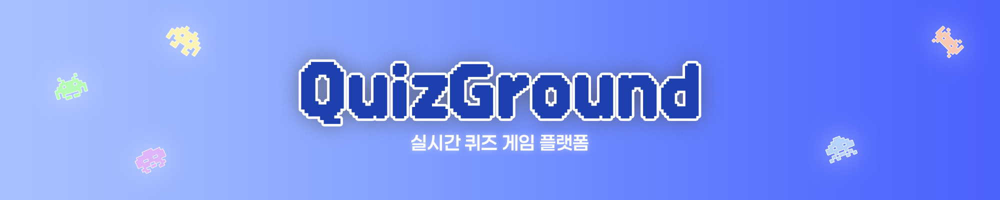
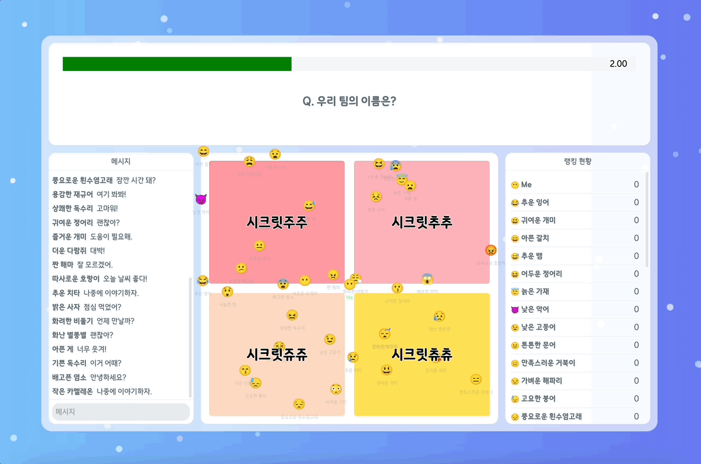
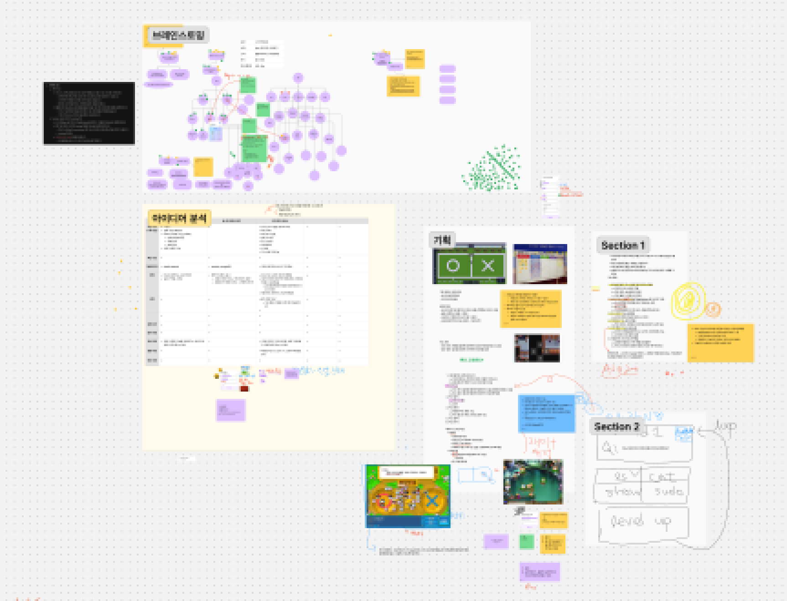
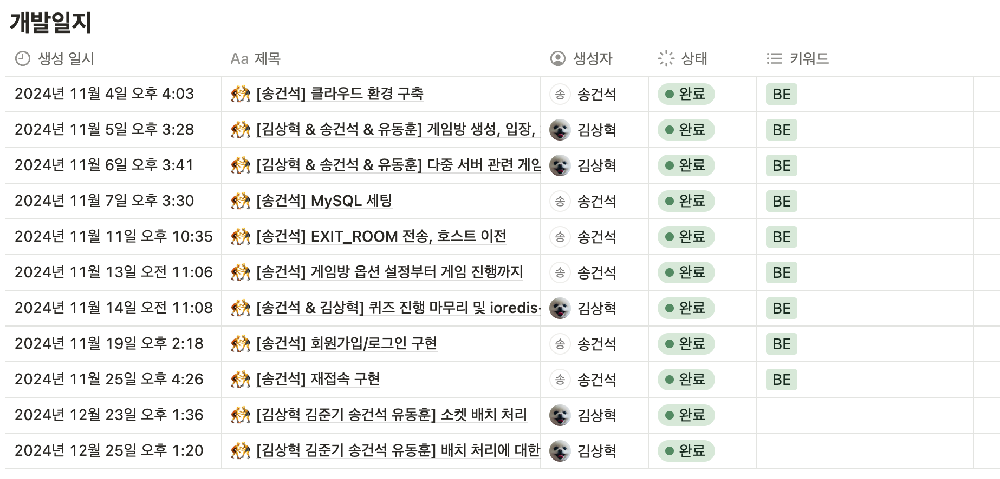
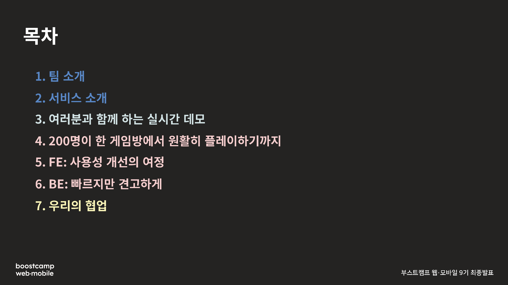

## 부스트캠프 멤버십 과정 소개

### 부스트캠프 간단 소개

네이버 커넥트 재단에서 운영하는 [**부스트캠프**](https://boostcamp.connect.or.kr/)는 **지속 가능한 개발자**가 될 수 있도록 기본기와 문제해결력 등을 기를 수 있는 과정입니다. Web·Mobile, AI Tech 과정이 있는데, 저는 Web·Mobile의 **웹 풀스택** 과정으로 지원하여 진행하였습니다.

### 멤버십까지 오는 과정

부스트캠프 멤버십 과정에 참여하기 위해서는 위 이미지와 같은 과정들을 거쳐야 합니다.

멤버십 이전에 거친 과정에 대한 간단한 후기는 [**부스트캠프 웹∙모바일 9기 웹 풀스택(JavaScript) 지원 후기**](https://s0n9.dev/p/boostcamp-apply-story/)를 참고해주세요!

### 일정

멤버십 과정은 위와 같이 진행되었습니다.

## 학습 스프린트

### 1~4주차 (1차 - 풀스택)

1차 스프린트에서는 정해진 기획에 맞춰 샘플 웹 서비스를 구현하였습니다.

저는 이전에 프론트엔드에서 기초적으로 사용되는 HTML, CSS, JS에 대해서 대략적으로만 알고 있는 상태였고 길게 사용해보지는 않은 상황이었는데, 해당 과정을 통해 언어의 문법, 브라우저 JS에서 DOM을 다루는 방법 등을 학습할 수 있었습니다.

백엔드는 express.js를 사용했습니다. 사실 이전에 학교 프로젝트에서 정말 간단한 CRUD API를 express를 사용하여 만들었었는데, 그 당시에는 express 자체에 대해서는 잘 모르는 상태로 구현하였던 것 같습니다. 하지만 이번 과정을 통해 express의 middleware 구조 등을 알게 되는 계기가 되었습니다.

### 5~8주차 (2차 - 백엔드)

2차 스프린트에서는 백엔드, 프론트엔드 중 선택해서 학습할 수 있었는데, 저는 원래 관심이 있던 백엔드를 선택하였습니다.

내용에 관해서는 어디까지 이야기할 수 있을지 몰라 뭔가 적기가 애매하네요.

해당 기간에는 백엔드 라이브러리가 로우 레벨에서 어떻게 작동하는지 등을 학습할 수 있는 기회였습니다.

## 그룹 프로젝트

### 프로젝트 소개

프로젝트로는 유저들이 소통하며 퀴즈를 풀 수 있는 퀴즈 게임 플랫폼 [**QuizGround**](http://quizground.site)를 제작하였습니다!

GitHub는 [**여기**](https://github.com/boostcampwm-2024/web10-QuizGround)에서 확인 가능합니다!

실시간으로 유저들의 선택지를 확인할 수 있으며, 채팅도 가능합니다. 모드는 랭킹, 생존 모드가 존재하며 퀴즈를 직접 제작하여 게임을 진행할 수 있습니다.

### 기획 단계

먼저 그룹 프로젝트 기간 시작 전부터 1주차까지 프로젝트 기획을 진행하였습니다.

실제 진행했던 프로젝트 말고도 여러 선택지를 두고 팀원들과 함께 고민을 하였고, 최종적으로 실시간 퀴즈 게임 플랫폼으로 결정하였습니다.

이 아이디어로 결정하게 된 이유는 재미있을 것 같아서 였습니다. 저는 프로젝트를 진행하면서 일단 개발을 하는 사람들이 재미있어야 동기부여도 더 되고 디테일한 아이디어들을 뽑아내기 좋다고 생각하였고, 이런 부분들을 회의 중에도 얘기하였습니다.

### 개발 단계

저는 팀에서 백엔드를 맡았고, 백엔드 팀원은 총 3명이서 진행하였습니다.

저는 일단 초기 클라우드 세팅을 맡아 VPC, 서브넷 등을 설정해두고, 테스트용 서버를 생성해두었습니다. 이후 메인 로직은 백엔드 3명이 회의하며 JetBrains 사에서 제공하는 [**Code With Me**](https://www.jetbrains.com/ko-kr/code-with-me/)를 이용하여 함께 코드를 작성하였습니다.

이후에는 구현 기능들을 주별 계획 단계에서 나누어 진행하였습니다. 중간 개발 단계에서도 회의가 필요한 경우 모여서 이야기를 나누었습니다. 저희는 [**Gather**](https://www.gather.town/)를 사용 중이었기에 빠른 소통이 가능하였습니다.

마지막 즈음에 Auth 기능들을 구현할 지 고민하다 제가 맡아 구현하게 되었습니다. 처음 구현해보는 것들이라 어려움이 있었지만 최대한 필요한 것들을 찾아보며 구현하였습니다.

### 데모데이

마지막 주차에는 최종 발표 준비와 여러 버그 수정 등을 진행하였습니다.

캠프 운영진분들이 발표에서 신경써야 하는 것들 등을 잘 알려주셔서 그런 부분들을 참고하여 발표 준비를 하였습니다. 발표 순서는 다음과 같이 하였습니다.

## 부스트캠프에서 얻은 것

### 페어 프로그래밍 및 프로젝트 경험

페어 프로그래밍의 경우에는 학교 프로젝트를 진행했을 때에도 약간씩이나마 경험했습니다. 다만, 부스트캠프에서처럼 체계와 규칙을 가지고 했던 적은 없어 새로운 경험이었던 것 같습니다.

프로젝트 같은 경우에도, 이렇게 하나의 프로젝트에만 한 달 넘게 집중해 본 적이 꽤 오랜만이었던 것 같습니다. 개발 과정에서 여러 고려해야 할 것들(시간, 유저 편의성 등), 고민들(코드 구조, 구현할 기능 선택 등)을 경험할 수 있어 좋았습니다.

### 기록의 중요성

부스트캠프를 진행하며, 기록의 중요성에 대해 듣게 되는 경우가 많았습니다. 그래서 저는 부스트캠프 과정 중 발생한 문서들을 최대한 제 노션에 적어두려고 노력하였습니다.

프로젝트 진행 중에는 코드 외적으로 하게 되는 일들이 많아져 문서가 덩달아 많아지게 되었고, 프로젝트 진행 과정 거의 전부를 팀 노션에 적어두게 되었습니다. 사실 프로젝트 이전 과정을 기록할 때에는 나중에 필요할 것 같은 것만 적어두자는 생각이 컸는데, 프로젝트 팀원 분 중 회의 과정, 개발 과정, 회고까지 전부 작성하자고 해주신 분이 계셔서 거의 전부를 작성하게 되었습니다. 덕분에 나중에 문제가 발생하였을 때에도 왜 이런 일이 발생했는지 원인을 찾기가 쉬웠고, 어떤 내용들이 회의 중에 나왔는지 찾기에도 쉬웠습니다. 또, 다른 사람들이 어떤 작업들을 했는지 파악하며 전체적인 그림을 확인하는 것이 가능했습니다.

## 향후 계획

### 학습 정리 후 블로그 업로드

캠프를 진행하며 찾아봤던, 혹은 알게 되었던 것들을 간간히 노션에 정리해 둔 것들이 있습니다. 이런 것들을 좀 더 발전시켜 블로그에 업로드 시키는 것이 계획입니다.

~~다만, 이 글 작성도 계획은… 거의 한 달 전부터…..~~

### 프로젝트 정리

현재까지 했던 프로젝트들을 정리하고 있습니다.

부스트캠프에서 했던 그룹 프로젝트를 제외하고는 거의 전부 학교에서 했던 프로젝트이기에, 부스트캠프 프로젝트를 메인으로 두고 이력서를 작성하려 합니다.
