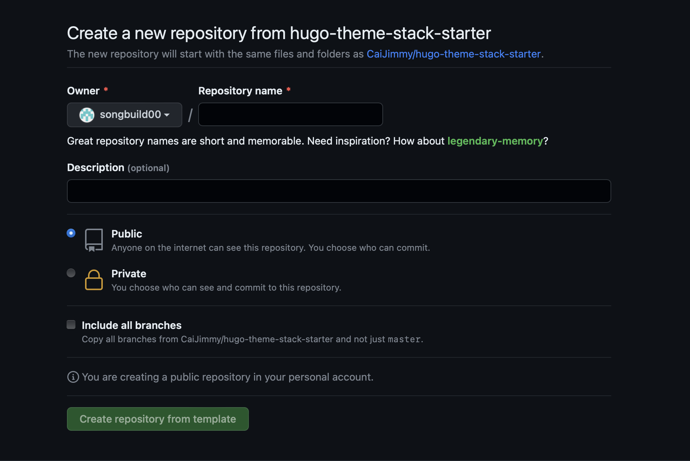
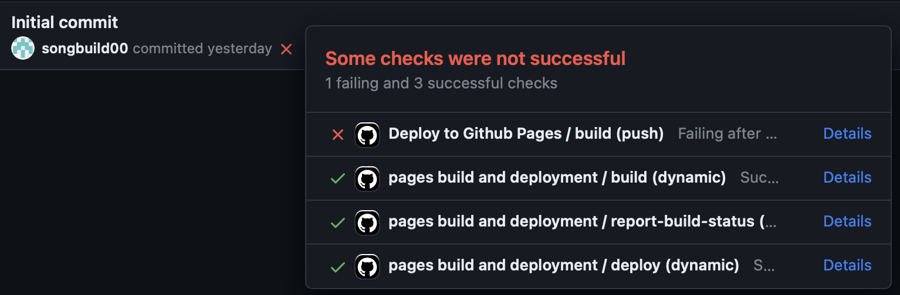
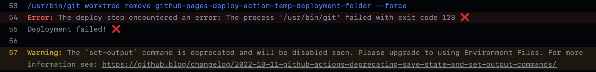
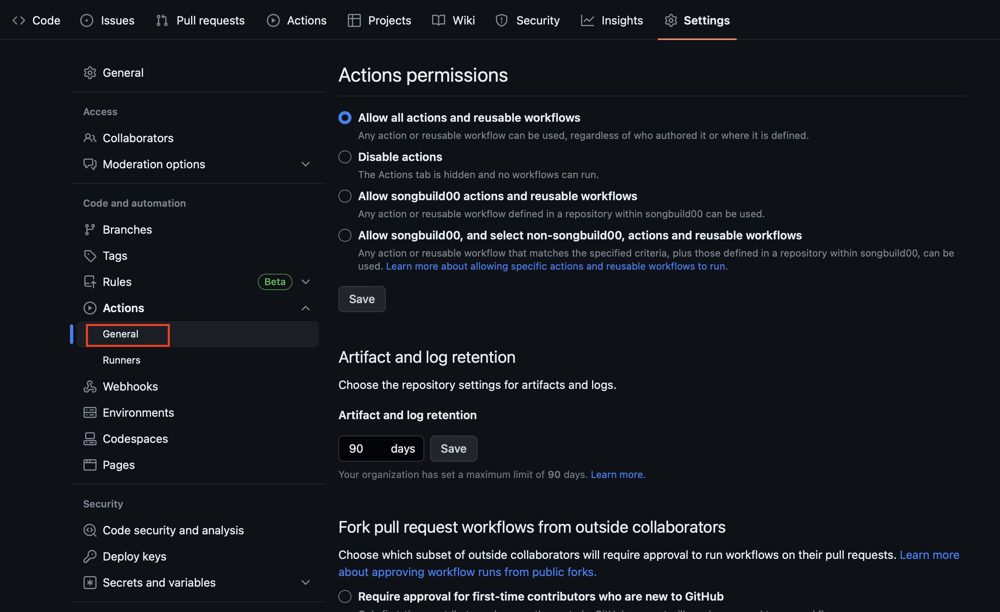
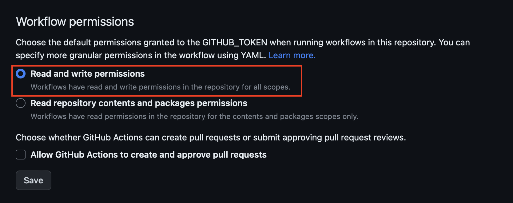

Github Pages를 이용한 블로그를 만들어보았습니다. Hugo를 이용하였지만 실제로 Go언어로 코딩을 하거나 그런 부분은 전혀 없습니다. 나중에 수정하고 싶거나 그런 부분은 있지만, 아직은 이 것에 만족하겠습니다.

사실 이전에도 만들어뒀던 Github Pages 블로그가 있었는데(해당 블로그도 Hugo의 PaperMod 테마를 이용한 블로그였습니다), 다른 테마를 보고 이 테마를 새로 적용하고 싶다는 생각에 그냥 갈아엎어버렸습니다. (글을 써둔 것도 딱히 없었기에...)

> 이 글은 블로그 만들기 설명이라기에는 여러 부분들이 생략되어 있지만, 그래도 제가 했던 부분들을 따라가려 노력하였습니다.

## 시작

저는 Hugo의 [Stack](https://themes.gohugo.io/themes/hugo-theme-stack/) 테마를 사용하였습니다. 해당 사이트에 들어가면 Quickstart 부분이 있는데 그 부분에 들어가줍니다.

그 후, README에 적힌 대로 따라해줍니다.

template을 사용한 Repository 생성을 해줍니다. Repository name 은 [Github ID].github.io 로 해줍니다. 저는 혹시 몰라 밑의 Include all branches 도 체크해줬던 것 같습니다!

그렇게 하고 나면 이렇게 generated from과 같이 Repository가 생성되게 됩니다.

## 그런데...

이미 설정되어 있어, 바로 작동된 Github Actions가 실패하였습니다. Hugo를 사용하여 빌드하고 다른 branch에 배포하는 부분이 실패한 것 같아, 자세히 확인해보았습니다.

git 명령어를 사용하여 worktree remove를 하는 부분에서 에러가 난 것 같습니다. 제가 git 명령어나 구조를 다 알고 있지는 않아서 잘 모르겠는데, 구글링해 본 결과 설정을 고쳐주니 해결되었습니다.

Repository의 Settings에서 Actions-General 부분에 들어가줍니다.

그리고 밑을 내려보면 Workflow permissions 부분에서 Read and write permissions 부분으로 체크되어 있는지 확인해보고, 체크해주면 됩니다.

> 이후 설정은 다음 편에 계속됩니다.
